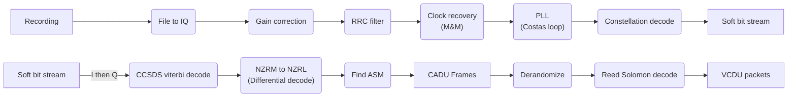

# NOAA 20 Demodulator/Decoder

by Christopher Tait

### Non-python requirements:

- [GNU Radio 3](https://github.com/gnuradio/gnuradio)
- [gr-satellites](https://github.com/daniestevez/gr-satellites)
- [libaec](https://github.com/MathisRosenhauer/libaec)

## Running the project:

To demodulate a cs16 recording of a NOAA 20 HRD transmission, open `demodulate_from_file.grc` in GNU Radio Companion, and select the file in the `File Source` block. You can also adjust the `Skip Head` block to skip the first part of the recording if there is a delay before the start of the recording. Then select the output file in the `File Sink` block.

The output of the grc flowgraph is a file containing fixed length VCDU packets. This file can then be decoded using [weatherdump](https://github.com/luigifcruz/weatherdump) in `hrd none` mode (indicating that there is no modulation as it was already removed by the flowgraph). The VIIRS M6 data can be extracted using `decode.py`

## Demodulation

